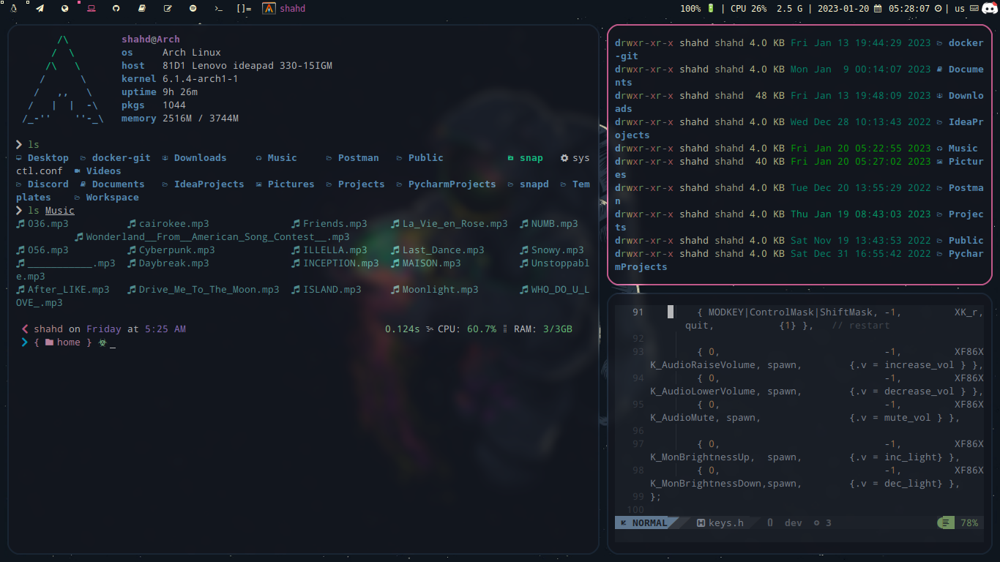
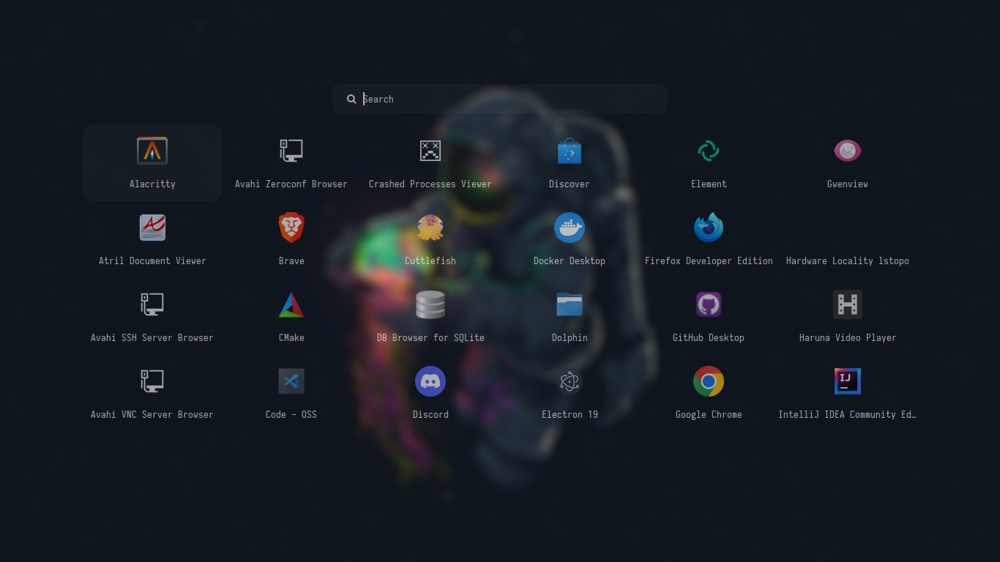
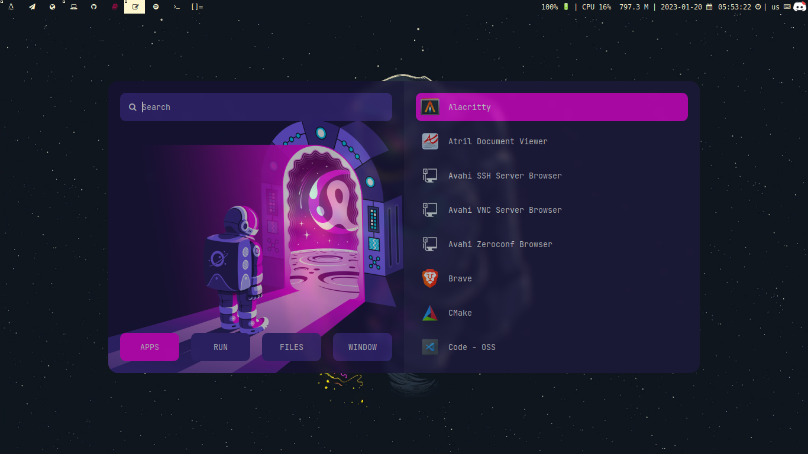
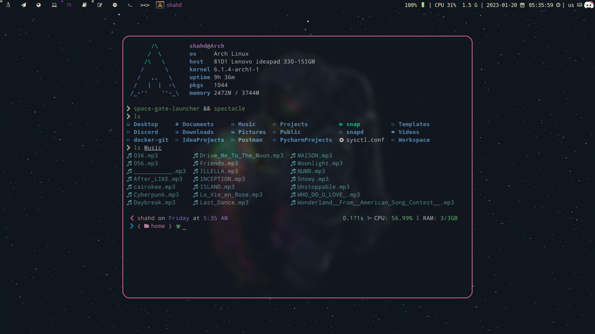
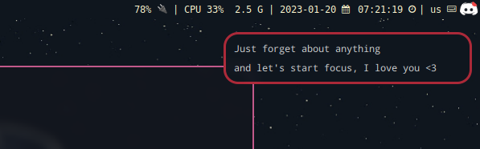

# Screenshots

---

## Configuration files

- [alacritty](https://github.com/0x73hahd/dotfiles/tree/main/.config/alacritty) as a default terminal.
- [dunst](https://github.com/0x73hahd/dotfiles/tree/main/.config/dunst) to manage the notifications.
- [dwm](https://dwm.suckless.org/) and you can find the dwm config [here](https://github.com/0x73hahd/dwm-config).
- I use [NvChad](https://github.com/NvChad/NvChad) as a default editor.
- [picom](https://github.com/0x73hahd/dotfiles/tree/main/.config/picom) a compositor for X.
- [rofi](https://github.com/0x73hahd/dotfiles/tree/main/.config/rofi/launchers) a window switcher and dmenu replacement.
- [zsh](https://github.com/0x73hahd/dotfiles/tree/main/.config/zsh) as a main shell.
- [Oh My Posh](https://ohmyposh.dev/) a prompt theme engine for any shell.